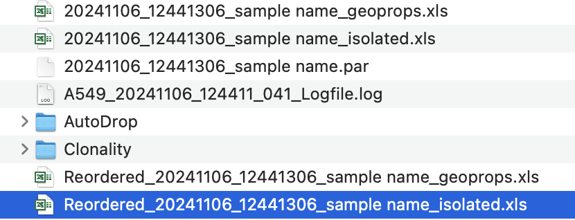
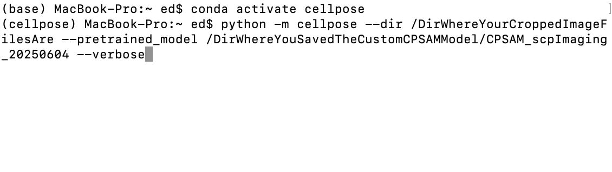
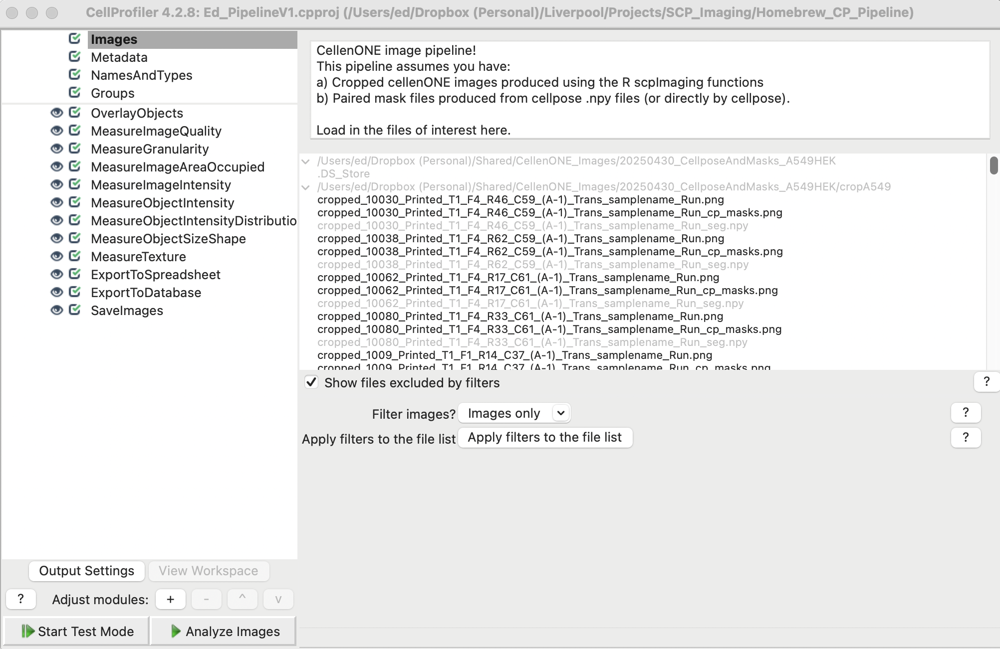

```{r setup, include=FALSE}
knitr::opts_chunk$set(echo = TRUE)
setwd('/Users/ed/Dropbox (Personal)/Shared/scpImaging_Testing')
knitr::opts_knit$set(root.dir = getwd())
```

# The scpImaging package
`scpImaging` is a standalone R package for working with micrographs generated during cellenONE-based single-cell preparations. It has been designed around single-cell proteomics, and interfaces with the `scp` R package and workflows, but is standalone and can be used with different workflows. I is designed to work any cell-based data from the cellenONE.

## A typical scpImaging workflow
### Common pipeline
The typical workflow for using 'scpImaging' is as follows:

1. Load the package with `library(scpImaging)`.
2. Cell data is loaded as a data.frame, this can be a sample annotation file generated with `scpAnnotator` (coming soon), or can be the cell tables generated by the cellenONE instrument during the run. 

* Depending on if any pre-processing has occured with your cell data file, it is possible the filenames in your celldata data frame may have been interpreted as hyperlinks. The `cleanFilenames()` function is provided in case this has happened and is used to restore filenames to their original state.

3. CellenONE micrographs are cropped to 75x75 pixel images, centred on the cell being sorted. This is performed using the `cropImages()` function.
4. Cellpose is used to identify (segment) cells in the cropped images. A custom Cellpose-SAM model is used for this, and is available with the preprint/figshare (coming soon)
5. The image masks, are saved by Cellpose as .npy files. The `npyMasksToPng()` function converts these to PNG files.
6. The `countCells()` function counts the image mask per image, and returns a data frame with the cell counts per image. 

### Cellprofiler pipeline components
Note: If you are just using `scpImaging` for doublet/multiplet detection you can stop at this point. If you wish to use CellProfiler-based image analysis and/or iSEE visualisation you should continue.

The custom Cellprofiler pipeline included with the `scpImaging` package is designed to work with the cropped images generated by the `cropImages()` function and the .png masks generated in step 5. 

6. The Cellprofiler pipeline is run. If default settings are unchanged, this produces alternative overlay images that can be used if preferred, as well as .csv files, the specific file of interest is called `ImageAttributesCellMask.csv`

7. The cell data data.frame or singlecellexperiment object is updated with filenames for the cropped images, mask images, overlay images, as well as overlayed parent images using the `generateImageColumns()` or in the case of a singlecellexperiment, with `generateImageColumnsSCE()`.

8. The cellprofiler data can be merged with the initial cell data data.frame form the previous step, using the `addCellProfilerAttributes()`. Alternatively, if you have already processed your singlecelldata in a singlecellexperiment or qfeatures format, you can add the CellProfiler attributes to the singlecelldata using the `addCellProfilerAttributesSCE()` function as an alternative.

### iSEE pipeline components.
iSEE is an R Shiny-based app for interactive visualisation and exploration of summerisedexperiment or singlecellexperiment objects. If you use `scp`-based workflows, your single-cell data will be in an appropriate format for `iSEE`-based use, allowing you to easily visualise your data and potentially share with others in an online format.

The core `scpImaging` component for `iSEE`-based visualisation is the `cellenONEplot()`. It also makes use of the `overlayMask()` and `overlayMaskOnParent()` functions to overlay the cell masks on the images, either as an outline or as a transparent overlay.

9. Next the additional images with the overlay, and overlayed parent images are generated with `overlayMask` and `overlayMaskOnParent()`. These are saved as .png files. If using the default settings, the filenames for these will have been automatically generated in the previous step.

10. Finally use iSEE, along with the custom cellenONEplot(), to enable visualisation of your cellenONE images, and cell segmentation.

## Detailed workflow components 

### 1. Load the package with `library(scpImaging)`. 

This will require install from github. We recommend using devtool::install_github, you will need to set up a github personal access token for this. 

```{r}
# install.packages("devtools") # if required
library(devtools)
devtools::install_github("emmottlab/scpImaging")
library(scpImaging)
```

### 2. Load the cell data

This can be either an sample annotation file from `scpAnnotator`:
```{r}
dat <- read.csv('data/scp_sample_annotation_table_Full_cleaned.csv')

# Inspect the data frame
head(dat)
```
Or a cellenONE-generated cell table

These files have the file extension .xls, but is actually actually a tab-separated file. For each cell dispense run on a cellenONE, 4 .xls files are produced. You want the file that starts 'Reordered_' and ends '_isolated.xls'.


```{r}
datCellenONE <- read.delim('data/Reordered_20241106_12441306_sample name_isolated.xls', sep = '\t', header = TRUE)

# inspect the data frame
head(datCellenONE)
```

### 2b. Clean the filenames
If you note, in this second example, the filenames in the 'ImageFile' and 'Background' columns are hyperlinks, we can clean these up using the `cleanFilenames()` function. 

```{r}
# Remove the hyperlinks from the filenames in the 'ImageFile' column
datCellenONE <- cleanFilenames(datCellenONE, 'ImageFile')

# And in the 'Background' column
datCellenONE <- cleanFilenames(datCellenONE, 'Background')

head(datCellenONE)
```
The artifact has been removed from the 'ImageFile' and 'Background' columns.

### 3. CellenONE micrographs are cropped to 75x75 pixel images, centred on the cell being sorted. 
This is performed using the `cropImages()` function.

```{r warning=FALSE}
cropImages(dat, pixel_offset = 37,output_dir = 'croppedImages',input_dir = 'www',create_dir = TRUE)

```

The pixel offset tells the function how many pixels to crop from each side of the image, so 37 pixels on each side will result in a 75x75 pixel image. The `output_dir` is where the cropped images will be saved, and `input_dir` is where the original images are located. The `create_dir = TRUE` argument will create the output directory if it does not already exist. 

This will give a warning if ImageFiels are missing. Note if using scpAnnotator, this is expected, as you will have rows in the file for the Carrier, Reference, empty, and control channels. As this creates new files, it doesn't actually return anything to the R environment.

### 4. Cellpose is used to identify (segment) cells in the cropped images. 
A custom Cellpose-SAM model is used for this, and is available with the preprint/figshare (coming soon)

This step is performed in the terminal. If you have installed Cellpose in a conda environment following the [install instructions available on the cellpose github](https://github.com/MouseLand/cellpose), you can run the following command in the terminal/console:
`conda activate cellpose`

`python -m cellpose --dir /DirWhereYourCroppedImageFilesAre --pretrained_model /DirWhereYouSavedTheCustomCPSAMModel/CPSAM_scpImaging_20250604 --verbose`



### 5. The image masks, are saved by Cellpose as .npy files. 
The `npyMasksToPng()` function converts these to PNG files. While cellpose can save masks as .pngs directly, these are typically to faint to see the masks directly. The `npyMasksToPng()` function converts the .npy files to .png files. It makes use of the `reticulate` library, and requires a functional python/numpy installation.

```{r}
npyMasksToPng(input_dir = 'data',output_dir = 'masks')
```
This will convert all .npy files in the input directory to .png files in the output directory. It will show errors if files are missing but will run. 

### 6. The `countCells()` function counts the image mask per image, and returns a data frame with the cell counts per image. 

```{r}
# Call countcells
datCellCount <- countCells(path = 'www', suffix = '_cp_masks.png') 

# Inspect the data frame
head(datCellCount)
```

## Detailed CellProfiler workflow

Note: If you are just using `scpImaging` for doublet/multiplet detection you can stop at this point. If you wish to use CellProfiler-based image analysis and/or iSEE visualisation you should continue.


### 6. The Cellprofiler pipeline is run. 

Please install [Cellprofiler](https://github.com/CellProfiler) following the github instructions.



If default settings are unchanged, this produces alternative overlay images that can be used if preferred, as well as .csv files, the specific file of interest is called `ImageAttributesCellMask.csv`.

The only parts you may wish to change are the directories for saving the output, in the `ExportToSpreadsheet`, `ExportToDatabase` and `SaveImages` modules.


### 7. The cell data data.frame or singlecellexperiment object is updated with filenames for the additional images being generated
These include the cropped images, mask images, overlay images, as well as overlayed parent images using the `generateImageColumns()` or in the case of a singlecellexperiment, with `generateImageColumnsSCE()`.

The function takes a column as the initial filename source, and adds suffixes and prefixes to distinguish the different cropped images, mask files, and overlayed images. 

```{r}
# Inspect dat first
head(dat)

dat <- # Generate the image columns
datplus <- generateImageColumns(dat,source_column =  "ImageFile")

# Inspect the dat containing the new columns
head(datplus)
```


### 8. The cellprofiler data can be appended to the dataframe with `addCellProfilerAttributes()`

The cellprofiler data can be merged with the initial cell data data.frame form the previous step, using the `addCellProfilerAttributes()`. Alternatively, if you have already processed your singlecelldata in a singlecellexperiment or qfeatures format, you can add the CellProfiler attributes to the singlecelldata using the `addCellProfilerAttributesSCE()` function as an alternative.
```{r}
# read in Cellprofiler output as a data fram
cellProfilerDF <- read.csv('data/ImageAttributesCellMask.csv')

# add the cellprofiler attribues
datCP <- addCellProfilerAttributes(dat,cellProfilerDF, key1_col = 'Cropped', multiplet_handling = "takemaxarea")

# inspect datCP (note - this has a 'lot' of columns)
head(datCP)
```

The above function relies on there being a 'Cropped' column in the cell data data.frame, which is generated by the `generateImageColumns()` function run in step 7.

Typical ways to break this are to:
* forget to add the relevent image columns with `generateImageColumns()`
* have not cleaned the filenames earlier. 

## Detailed iSEE workflow
[iSEE](https://www.bioconductor.org/packages/devel/bioc/html/iSEE.html) is an R Shiny-based app for interactive visualisation and exploration of summerisedexperiment or singlecellexperiment objects. If you use `scp`-based workflows, your single-cell data will be in an appropriate format for `iSEE`-based use, allowing you to easily visualise your data and potentially share with others in an online format.

The core `scpImaging` component for `iSEE`-based visualisation is the `cellenONEplot()`. It also makes use of the `overlayMask()` and `overlayMaskOnParent()` functions to overlay the cell masks on the images, either as an outline or as a transparent overlay.

### 9. Generating overlayed images
Having generated the various filenames in step 7, , and overlayed parent images are generated with `overlayMask` and `overlayMaskOnParent()`. These are saved as .png files. If using the default settings, the filenames for these will have been automatically generated in the previous step.

```{r warning=FALSE}
overlayMask(image_input = 'croppedImages',mask_input = 'masks',output_target = 'overlays')
```

The default behavior over overlayMask is to produce an outline around any identified cells. An alternative is to produce a transparant overlay. This can be controlled using the 'mode' option where:
* mode = "outline" is the default
* mode = "overlay" is an alternative
 Outline and overlay colours can be controlled using:
* outline_col = "cyan" (default)
* overlay_col = "yellow" (default)
Outline line width and overlay transparancy can be controlled with the following options respectively:
* outline_lwd = 2 (default)
* overlay_alpha = 0.4 (default)

The `overlayMaskOnParent()` function overlays the mask on the parent image, and can be used in a similar way to `overlayMask()`, but it requires the cell data dataframe for the necessary X and Y coordinates used for the original crop.

```{r warning=FALSE}
overlayMaskOnParent(parent_image_input = 'www',mask_input = 'masks',coord_df = dat,output_target = 'overlayParent')
```

### 10. Finally use iSEE, along with the custom cellenONEplot(), to enable visualisation of your cellenONE images, and cell segmentation.


## End of pipeline!


## Session information
```{r}
sessionInfo()
```


```{r setup2, include = FALSE}
knitr::opts_chunk$set(
    collapse = TRUE,
    comment = "",
    crop = NULL
)
```

&copy Ed Emmott 2025, [emmottlab.org](https://emmottlab.org) University of Liverpool.
